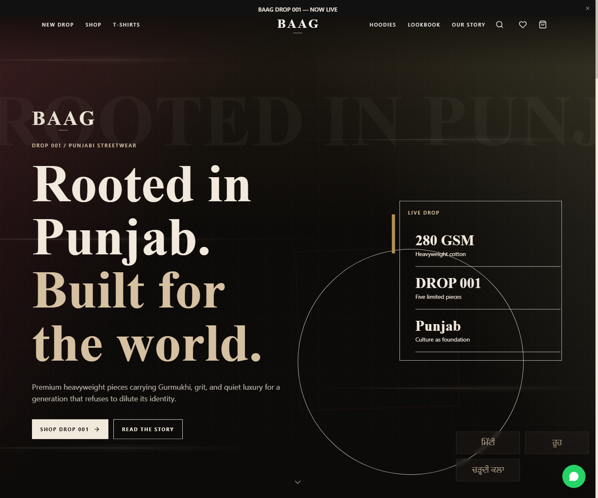
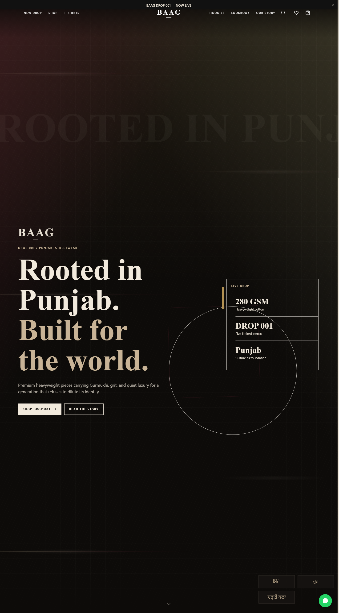
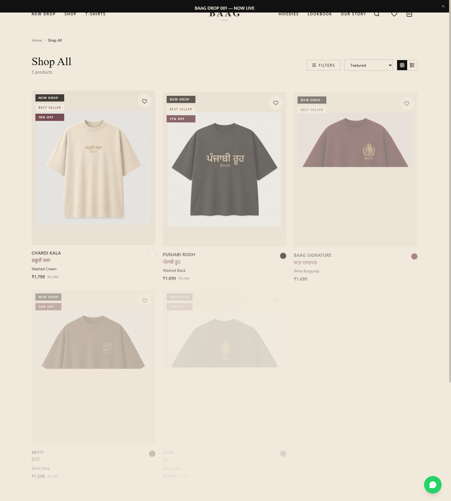

# BAAG — Punjabi Streetwear E-commerce Frontend

A premium direct-to-consumer fashion storefront for **BAAG**, a Punjabi streetwear brand focused on modern presentation, cultural identity, responsive shopping flows, and a polished editorial experience.

The runnable application lives in the `app/` directory.



## Highlights

- Responsive e-commerce storefront
- Product browsing, filtering, sorting, search, cart, and wishlist flows
- Local cart persistence
- Product, collection, brand-story, lookbook, FAQ, policy, contact, tracking, and utility pages
- Punjabi/Gurmukhi typography support
- Framer Motion interactions
- SEO and accessibility-focused frontend structure
- Shopify Storefront API integration points
- Netlify and Vercel-ready build setup

## Tech Stack

- React 19
- TypeScript
- Vite
- Tailwind CSS
- Framer Motion
- React Router
- Zustand
- Radix UI primitives
- React Hook Form + Zod
- Lucide React

## Screenshots

### Homepage


### Products



### Shop



## Getting Started

```bash
git clone https://github.com/harmanhanjra/KIMI-BAAG-Website.git
cd KIMI-BAAG-Website/app
npm install
cp .env.example .env
npm run dev
```

The Vite development server normally runs at `http://localhost:5173`.

## Environment Variables

Create a local `.env` from `.env.example`.

```env
VITE_SHOPIFY_STORE_DOMAIN=your-store.myshopify.com
VITE_SHOPIFY_STOREFRONT_API_TOKEN=your-storefront-api-token
VITE_ENABLE_SHOPIFY_CHECKOUT=true
```

Do not commit real credentials or environment-specific values.

## Build

```bash
cd app
npm run build
```

The production bundle is emitted to `app/dist/`.

## Deployment

### Vercel

Import the repository and configure the project root as `app`, then use the standard Vite build:

- Build command: `npm run build`
- Output directory: `dist`

Add production environment variables in the deployment dashboard.

### Netlify

The `app/` directory includes `netlify.toml`.

You can also build manually:

```bash
cd app
npm install
npm run build
```

Then deploy `app/dist/`.

A verified public deployment URL is not currently recorded in the repository metadata.

## Project Structure

```text
KIMI-BAAG-Website/
├── app/
│   ├── public/
│   ├── src/
│   │   ├── components/
│   │   ├── data/
│   │   ├── lib/
│   │   ├── pages/
│   │   ├── store/
│   │   └── types/
│   ├── .env.example
│   ├── package.json
│   └── vite.config.ts
├── baag-home-final.png
├── baag-products-final.png
└── baag-shop-final-fixed.png
```

## Shopify Integration

The frontend already has Shopify-oriented configuration and integration points. For production use:

1. Configure the store domain and Storefront API token through deployment environment variables.
2. Replace any remaining static product data with Storefront API queries.
3. Connect cart/checkout flows to Shopify checkout.
4. Validate real inventory, order tracking, contact, and newsletter integrations before launch.

## Security

- Never commit `.env` files containing real values.
- Keep deploy-time configuration in Vercel/Netlify environment settings.
- Rotate any token that has been exposed publicly if it is sensitive or can be abused.

## Additional Documentation

More implementation notes are available under:

- `app/README.md`
- `app/IMAGE-GUIDE.md`

## License

All rights reserved — BAAG 2026.
